# NotePad记事本应用
## 项目概述
本实验将基于NotePad应用实现功能扩展

基本要求：

•NoteList界面中笔记条目增加时间戳显示

•添加笔记查询功能（根据标题或内容查询）

•附加功能：根据自身实际情况进行扩充（至少两项）

•下载NotePad源码：https://github.com/fjnu-cse/NotePad

•NotePad源码分析：https://blog.csdn.net/llfjfz/article/details/67638499

## 初始功能
### 初始列表
以列表方式显示笔记本条目，每个条目仅显示标题，右上角可选择新建笔记与粘贴笔记


### 粘贴笔记
复制笔记后，点击Paste可粘贴剪贴板中的笔记


### 上下文菜单操作笔记
长按笔记条目，可显示上下文菜单，可进行笔记的打开、复制、删除、标题编辑


### 新建与保存笔记
点击新建笔记，可编写笔记内容，点击保存笔记，可保存笔记，保存后，笔记内容会成为笔记标题，点击删除，可删除笔记


### 编辑笔记
点击笔记条目，可进入编辑模式，可进行笔记内容与标题编辑，点击右上角可进行标题编辑，点击保存，可保存笔记


## 扩展功能
### 时间戳显示
#### 实现效果
NoteList界面中笔记条目增加时间戳显示，时间戳显示为笔记最后修改时间

#### 关键代码与逻辑
1.数据库列定义

在 NotePad.java 文件中定义了创建时间和修改时间的列名
```
public static final String COLUMN_NAME_CREATE_DATE = "created";
public static final String COLUMN_NAME_MODIFICATION_DATE = "modified";
```
2.插入数据时的时间戳处理

在 NotePadProvider.java 的 insert() 方法中，如果未提供时间戳，则自动添加当前时间
```
if (values.containsKey(NotePad.Notes.COLUMN_NAME_CREATE_DATE) == false) {
    values.put(NotePad.Notes.COLUMN_NAME_CREATE_DATE, now);
}
if (values.containsKey(NotePad.Notes.COLUMN_NAME_MODIFICATION_DATE) == false) {
    values.put(NotePad.Notes.COLUMN_NAME_MODIFICATION_DATE, now);
}
```
3.更新数据时的时间戳处理
在 NoteEditor.java 的 updateNote() 方法中，每次更新笔记时都会更新修改时间
```
values.put(NotePad.Notes.COLUMN_NAME_MODIFICATION_DATE, System.currentTimeMillis());
```
4.列表显示时间戳
在 NotesList.java 中，通过 SimpleCursorAdapter.ViewBinder 来格式化并显示时间戳
```
adapter.setViewBinder(new SimpleCursorAdapter.ViewBinder() {
    @Override
    public boolean setViewValue(View view, Cursor cursor, int columnIndex) {
        if (view.getId() == R.id.timestamp_text) {
            int idx = cursor.getColumnIndex(NotePad.Notes.COLUMN_NAME_MODIFICATION_DATE);
            long millis = cursor.getLong(idx);
            SimpleDateFormat sdf = new SimpleDateFormat("yyyy-MM-dd HH:mm", Locale.CHINA);
            sdf.setTimeZone(TimeZone.getTimeZone("Asia/Shanghai"));
            ((TextView) view).setText(sdf.format(new Date(millis)));
            return true;
        }
        return false;
    }
});
```
#### 截图

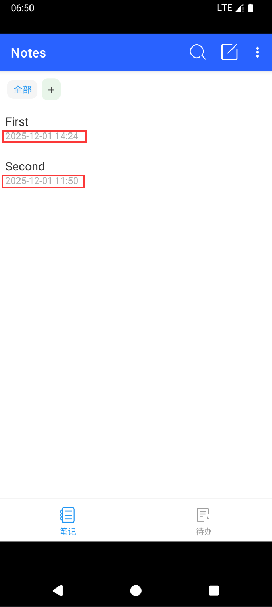
### 笔记查询
#### 实现效果
添加笔记查询功能，点击右上角放大镜，输入框中输入内容，根据标题或内容查询笔记
#### 关键代码与逻辑
1.NotePadProvider.query()方法

这是内容提供者的核心查询方法，负责处理所有针对笔记的查询请求。

关键步骤包括：
- **创建查询构建器**：
```
SQLiteQueryBuilder qb = new SQLiteQueryBuilder();
qb.setTables(NotePad.Notes.TABLE_NAME);
```
- **根据URI模式设置投影映射**：
```
switch (match) {
    case NOTES:
        qb.setProjectionMap(sNotesProjectionMap);
        break;
    case NOTE_ID:
        qb.setProjectionMap(sNotesProjectionMap);
        qb.appendWhere(
            NotePad.Notes._ID + "=" + 
            uri.getPathSegments().get(NotePad.Notes.NOTE_ID_PATH_POSITION));
        break;
    // ... 其他case
}
```
- **执行查询并返回Cursor**：
```
Cursor c = qb.query(db, projection, selection, selectionArgs, null, null, orderBy);
c.setNotificationUri(getContext().getContentResolver(), uri);
return c;
```
2.投影映射定义

在静态初始化块中定义的投影映射，用于控制查询返回的列
```
private static HashMap<String, String> sNotesProjectionMap;
static {
    sNotesProjectionMap = new HashMap<String, String>();
    sNotesProjectionMap.put(NotePad.Notes._ID, NotePad.Notes._ID);
    sNotesProjectionMap.put(NotePad.Notes.COLUMN_NAME_TITLE, NotePad.Notes.COLUMN_NAME_TITLE);
    sNotesProjectionMap.put(NotePad.Notes.COLUMN_NAME_NOTE, NotePad.Notes.COLUMN_NAME_NOTE);
    sNotesProjectionMap.put(NotePad.Notes.COLUMN_NAME_CATEGORY_ID, NotePad.Notes.COLUMN_NAME_CATEGORY_ID);
    sNotesProjectionMap.put(NotePad.Notes.COLUMN_NAME_CREATE_DATE, NotePad.Notes.COLUMN_NAME_CREATE_DATE);
    sNotesProjectionMap.put(NotePad.Notes.COLUMN_NAME_MODIFICATION_DATE, NotePad.Notes.COLUMN_NAME_MODIFICATION_DATE);
}
```
3.URI匹配器配置

用于识别不同类型的查询请求
```
private static final UriMatcher sUriMatcher;
static {
    sUriMatcher = new UriMatcher(UriMatcher.NO_MATCH);
    sUriMatcher.addURI(NotePad.AUTHORITY, "notes", NOTES);
    sUriMatcher.addURI(NotePad.AUTHORITY, "notes/#", NOTE_ID);
    // ... 其他URI模式
}
```
4.在Activity中的查询调用

例如在NotesList中使用 `managedQuery`
```
Cursor cursor = managedQuery(
    getIntent().getData(),            // 使用提供者的默认内容 URI。
    PROJECTION,                       // 返回每条笔记的 ID 和标题。
    null,                             // 不使用 where 子句，返回所有记录。
    null,                             // 不使用 where 子句，因此没有 where 参数。
    NotePad.Notes.DEFAULT_SORT_ORDER  // 使用默认排序。
);
```
#### 截图

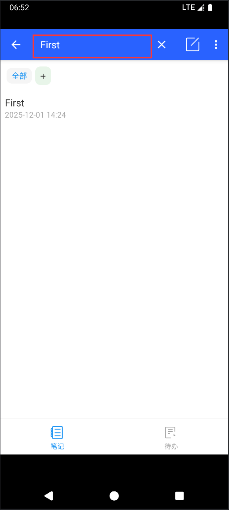
### 代办功能
#### 实现效果
点击下方导航栏中的待办，跳转到待办列表页面，显示待办事项与已完成事项，可对待办事项进行完成、取消完成，长按跳出上下文菜单，可进行待办条目的删除。点击右上角菜单，可对待办列表中的条目按照完成状态进行筛选或批量删除已完成事项。可点击待办条目，可进入待办详情页面
#### 关键代码与逻辑
1.数据模型定义 (NotePad.java)
```
public static final class Todos implements BaseColumns {
    private Todos() {}
    
    public static final String TABLE_NAME = "todos";
    public static final String CONTENT_TYPE = "vnd.android.cursor.dir/vnd.google.todo";
    public static final String CONTENT_ITEM_TYPE = "vnd.android.cursor.item/vnd.google.todo";
    
    public static final String COLUMN_NAME_TITLE = "title";
    public static final String COLUMN_NAME_CONTENT = "content";
    public static final String COLUMN_NAME_COMPLETED = "completed"; // INTEGER 0/1
    public static final String COLUMN_NAME_CREATE_DATE = "created";
    public static final String COLUMN_NAME_MODIFICATION_DATE = "modified";
}
```
2.待办事项列表界面 (TodoList.java)

关键功能包括：
- 显示待办事项列表
- 支持添加新待办事项
- 支持标记完成/未完成状态
- 支持过滤显示(全部/活动/已完成)
```
private void reload(String query) {
    // 加载待办事项数据
}

@Override
public boolean onOptionsItemSelected(MenuItem item) {
    if (id == R.id.menu_add) {
        startActivity(new Intent(Intent.ACTION_INSERT, NotePad.Todos.CONTENT_URI));
        return true;
    } else if (id == R.id.menu_filter_all) {
        mFilter = 0; reload(null); return true;
    }
    // 其他过滤选项...
}
```
3.待办事项编辑界面 (TodoEditor.java)

关键功能包括：
- 编辑待办事项标题和内容
- 设置完成状态
- 保存待办事项
```
@Override
protected void onResume() {
    // 加载待办事项数据
    Cursor c = managedQuery(mUri, new String[] {
            NotePad.Todos.COLUMN_NAME_TITLE,
            NotePad.Todos.COLUMN_NAME_CONTENT,
            NotePad.Todos.COLUMN_NAME_COMPLETED
    }, null, null, null);
}

@Override
public boolean onOptionsItemSelected(MenuItem item) {
    if (item.getItemId() == R.id.menu_save) {
        // 保存待办事项逻辑
        String title = mTitle.getText().toString();
        String content = mContent.getText().toString();
        // ...
    }
}
```
4.数据库支持 (NotePadProvider.java)

关键功能包括：
- 创建待办事项表
- 提供数据查询、插入、更新和删除操作
- 
主要代码片段：
```
db.execSQL("CREATE TABLE " + NotePad.Todos.TABLE_NAME + " ("
        + NotePad.Todos._ID + " INTEGER PRIMARY KEY,"
        + NotePad.Todos.COLUMN_NAME_TITLE + " TEXT,"
        + NotePad.Todos.COLUMN_NAME_CONTENT + " TEXT,"
        + NotePad.Todos.COLUMN_NAME_COMPLETED + " INTEGER,"
        + NotePad.Todos.COLUMN_NAME_CREATE_DATE + " INTEGER,"
        + NotePad.Todos.COLUMN_NAME_MODIFICATION_DATE + " INTEGER"
        + ");");
```
#### 截图

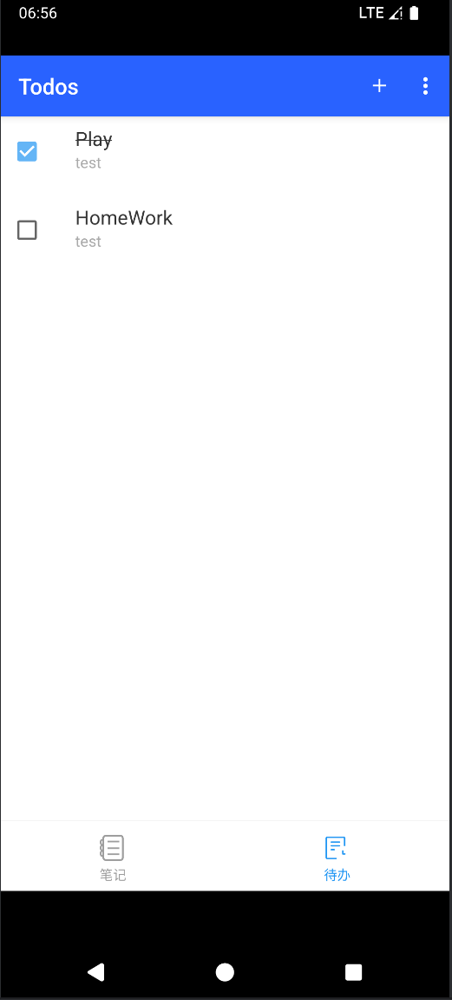
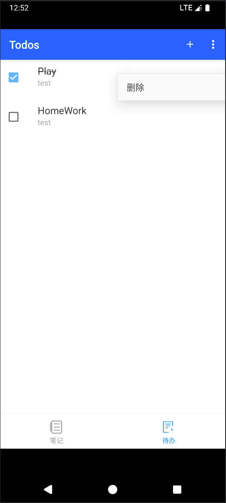
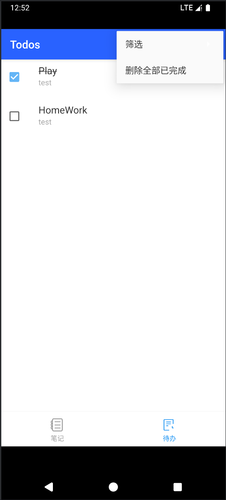
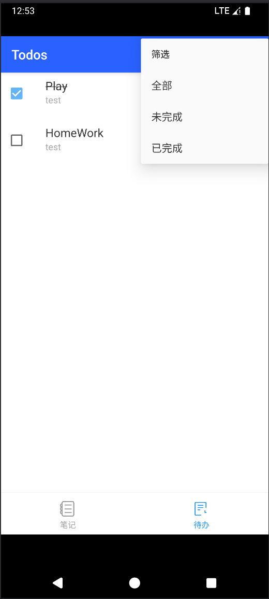
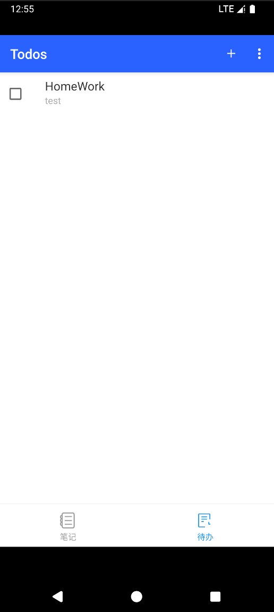
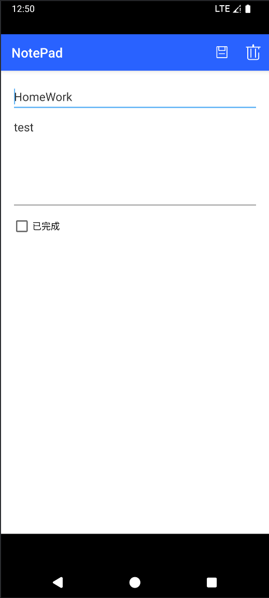
### 分类功能
#### 实现效果
笔记页面的上方，显示所有分类，可对分类进行添加、修改、删除。可点击分类条目，筛选不同分类的笔记。长按分类条目，可重命名分类或删除分类。
#### 关键代码与逻辑
1.数据模型定义 (NotePad.java)
```
public static final class Categories implements BaseColumns {
    public static final String TABLE_NAME = "categories";
    public static final Uri CONTENT_URI = Uri.parse(SCHEME + AUTHORITY + PATH_CATEGORIES);
    public static final String CONTENT_TYPE = "vnd.android.cursor.dir/vnd.google.category";
    public static final String CONTENT_ITEM_TYPE = "vnd.android.cursor.item/vnd.google.category";
    public static final String DEFAULT_SORT_ORDER = "_id ASC";
    public static final String COLUMN_NAME_NAME = "name";
    public static final String COLUMN_NAME_CREATE_DATE = "created";
    public static final String COLUMN_NAME_MODIFICATION_DATE = "modified";
}
```
2.数据库支持 (NotePadProvider.java)
- 创建分类表
```
db.execSQL("CREATE TABLE " + NotePad.Categories.TABLE_NAME + " ("
        + NotePad.Categories._ID + " INTEGER PRIMARY KEY,"
        + NotePad.Categories.COLUMN_NAME_NAME + " TEXT,"
        + NotePad.Categories.COLUMN_NAME_CREATE_DATE + " INTEGER,"
        + NotePad.Categories.COLUMN_NAME_MODIFICATION_DATE + " INTEGER"
        + ");");
```
- URI匹配和查询支持
```
case CATEGORIES:
    qb.setTables(NotePad.Categories.TABLE_NAME);
    qb.setProjectionMap(sCategoriesProjectionMap);
    break;
case CATEGORY_ID:
    qb.setTables(NotePad.Categories.TABLE_NAME);
    qb.setProjectionMap(sCategoriesProjectionMap);
    qb.appendWhere(
        NotePad.Categories._ID + "=" + uri.getPathSegments().get(NotePad.Categories.CATEGORY_ID_PATH_POSITION));
    break;
```
3.分类界面与交互 (NotesList.java)
- 渲染分类标签栏
```
private void renderCategoriesBar() {
    LinearLayout bar = (LinearLayout) findViewById(R.id.categories_bar);
    if (bar == null) return;
    bar.removeAllViews();

    addCategoryChip(bar, null, "全部", true);

    Cursor cats = getContentResolver().query(
            NotePad.Categories.CONTENT_URI,
            new String[]{ NotePad.Categories._ID, NotePad.Categories.COLUMN_NAME_NAME },
            null, null, NotePad.Categories.DEFAULT_SORT_ORDER);
    if (cats != null) {
        while (cats.moveToNext()) {
            long id = cats.getLong(0);
            String name = cats.getString(1);
            addCategoryChip(bar, id, name, false);
        }
        cats.close();
    }
    addAddCategoryChip(bar);
    highlightSelectedCategory(bar);
}
```
- 创建分类对话框
```
private void showCreateCategoryDialog() {
    final EditText input = new EditText(this);
    input.setHint("分类名称");
    new AlertDialog.Builder(this)
            .setTitle("新建分类")
            .setView(input)
            .setPositiveButton("确定", (d, w) -> {
                String name = input.getText().toString().trim();
                if (name.length() > 0) {
                    ContentValues v = new ContentValues();
                    v.put(NotePad.Categories.COLUMN_NAME_NAME, name);
                    getContentResolver().insert(NotePad.Categories.CONTENT_URI, v);
                    renderCategoriesBar();
                }
            })
            .setNegativeButton("取消", null)
            .show();
}
```
- 分类操作（重命名、删除）
```
private void showCategoryActions(long id, String currentName) {
    final CharSequence[] items = new CharSequence[]{ "重命名", "删除" };
    new AlertDialog.Builder(this)
            .setTitle(currentName)
            .setItems(items, (dialog, which) -> {
                if (which == 0) {
                    // 重命名分类
                    final EditText input = new EditText(this);
                    input.setText(currentName);
                    // ... 更新逻辑
                } else {
                    // 删除分类前，将该分类下笔记的分类置空
                    ContentValues v = new ContentValues();
                    v.putNull(NotePad.Notes.COLUMN_NAME_CATEGORY_ID);
                    // ... 删除逻辑
                }
            })
            .show();
}
```
4.笔记与分类关联 (NoteEditor.java)
- 分类选择器设置
```
private void setupCategorySpinner() {
    Cursor cats = getContentResolver().query(NotePad.Categories.CONTENT_URI,
            new String[]{ NotePad.Categories._ID, NotePad.Categories.COLUMN_NAME_NAME },
            null, null, NotePad.Categories.DEFAULT_SORT_ORDER);
    ArrayList<String> names = new ArrayList<>();
    mCategoryIds.clear();
    names.add("无分类");
    mCategoryIds.add(null);
    // ... 填充分类数据
}
```
#### 截图
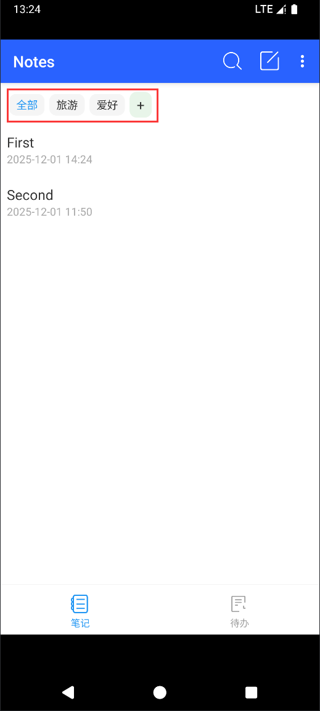
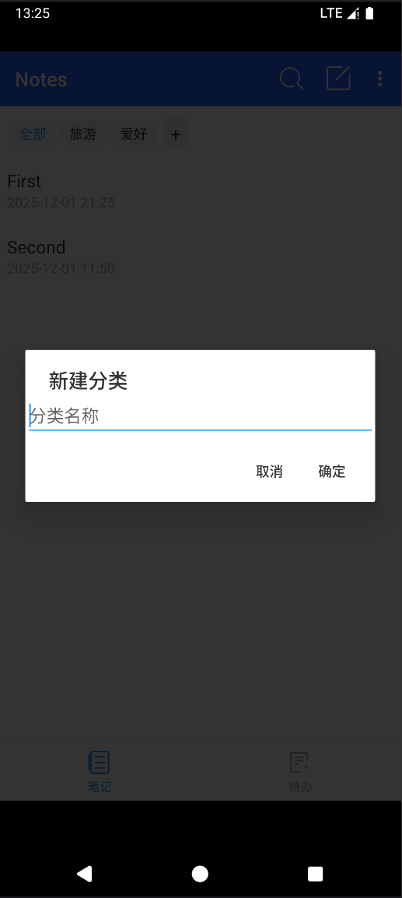
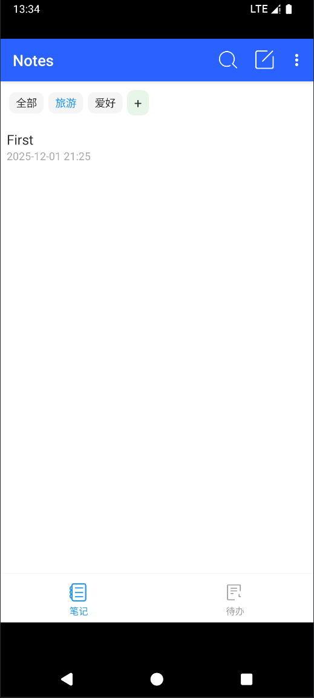
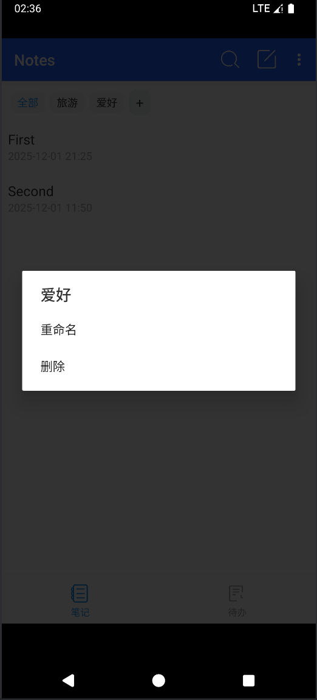
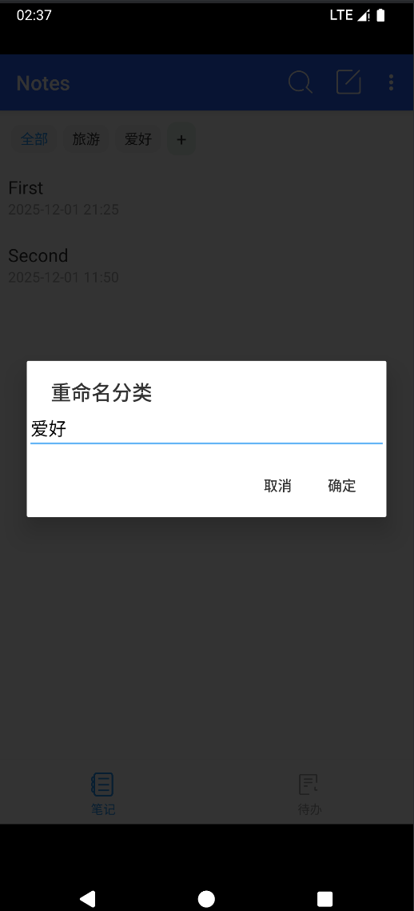
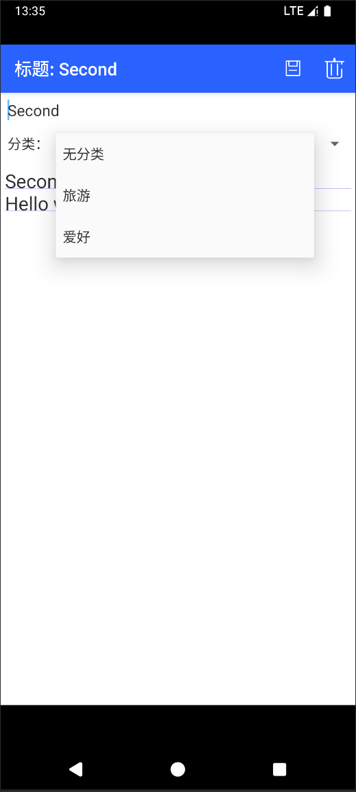
### UI美化
#### 实现效果
app整体界面进行美化，主要呈现蓝白风格，修改背景色、字体颜色、图标、按钮样式等，下方添加导航栏，分别指向“笔记”和“待办”页面。笔记列表界面，添加分类标签栏。
#### 关键代码与逻辑
1.图标资源设计

应用使用了多个矢量图标资源，统一采用 `24dp` 大小和 `@color/colorOnPrimary` 颜色，保证视觉一致性：

- ic_add.xml, ic_delete.xml, ic_edit.xml, ic_save.xml, ic_search.xml: 基础操作图标
- ic_tab_notes.xml, ic_tab_todos.xml: 底部导航标签图标

2.颜色主题配置
- colors.xml 文件定义了完整的色彩体系，用于统一UI风格：

```
<!-- 主要颜色 -->
<color name="colorPrimary">#2962FF</color>
<color name="colorOnPrimary">#FFFFFF</color>
<color name="colorSurface">#FFFFFF</color>
<color name="colorOnSurface">#333333</color>
<color name="colorOnSurfaceMuted">#9E9E9E</color>
<color name="colorDivider">#E0E0E0</color>

<!-- 低饱和度蓝色系列 -->
<color name="blue_light_muted">#BBDEFB</color>
<color name="blue_muted">#90CAF9</color>
<color name="blue_medium_muted">#64B5F6</color>
<color name="blue_deep_muted">#42A5F5</color>
<color name="blue_soft">#81D4FA</color>
<color name="blue_greyish">#90A4AE</color>
```
3.主题样式配置

styles.xml 文件定义了Material Design风格的主题：
```
<style name="AppTheme" parent="android:Theme.Material.Light">
    <!-- 主题主要颜色 -->
    <item name="android:colorPrimary">@color/colorPrimary</item>
    <item name="android:colorPrimaryDark">@color/blue_deep_muted</item>
    <item name="android:colorAccent">@color/blue_medium_muted</item>

    <!-- 文本颜色设置 -->
    <item name="android:textColorPrimary">@color/colorOnPrimary</item>
    <item name="android:textColor">@color/colorOnSurface</item>

    <!-- ActionBar 相关设置 -->
    <item name="android:titleTextColor">@color/colorOnPrimary</item>
    <item name="android:actionMenuTextColor">@color/colorOnSurface</item>

    <!-- 窗口背景 -->
    <item name="android:windowBackground">@color/colorSurface</item>
</style>
```
4.底部导航栏美化

在 activity_notes_list.xml 和 activity_todo_list.xml 中实现了底部导航栏，通过图标和文字组合提升用户体验：

关键代码段展示了如何动态设置选中状态的颜色：
```
// 底部导航美化：图标+文字，设置选中态
ImageView tabNotesIcon = (ImageView) findViewById(R.id.tab_notes_icon);
TextView tabNotesLabel = (TextView) findViewById(R.id.tab_notes_label);
ImageView tabTodosIcon = (ImageView) findViewById(R.id.tab_todos_icon);
TextView tabTodosLabel = (TextView) findViewById(R.id.tab_todos_label);

final int selectedColor = Color.parseColor("#2196F3");
final int unselectedColor = Color.parseColor("#9E9E9E");

if (tabNotesIcon != null && tabNotesLabel != null) {
    tabNotesIcon.setColorFilter(selectedColor);
    tabNotesLabel.setTextColor(selectedColor);
}
if (tabTodosIcon != null && tabTodosLabel != null) {
    tabTodosIcon.setColorFilter(unselectedColor);
    tabTodosLabel.setTextColor(unselectedColor);
}
```
#### 截图

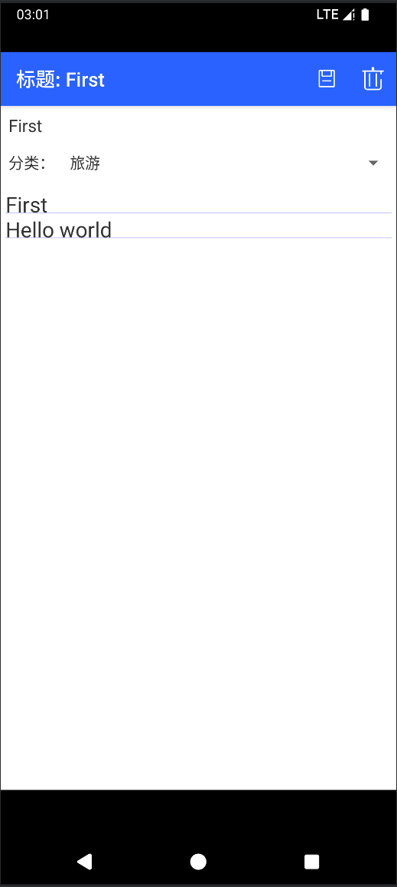

