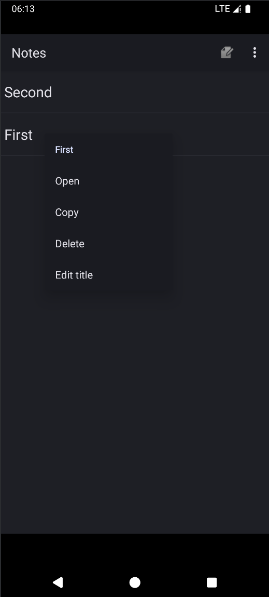
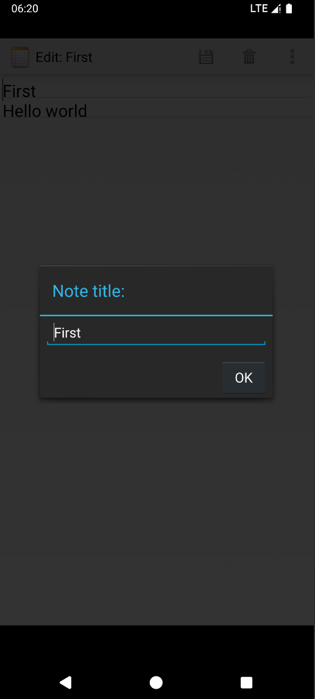

# NotePad记事本应用
## 项目概述
本实验将基于NotePad应用实现功能扩展

基本要求：

•NoteList界面中笔记条目增加时间戳显示

•添加笔记查询功能（根据标题或内容查询）

•附加功能：根据自身实际情况进行扩充（至少两项）

•下载NotePad源码：https://github.com/fjnu-cse/NotePad

•NotePad源码分析：https://blog.csdn.net/llfjfz/article/details/67638499

## 初始功能
### 初始列表
以列表方式显示笔记本条目，每个条目仅显示标题，右上角可选择新建笔记与粘贴笔记

### 粘贴笔记
复制笔记后，点击Paste可粘贴剪贴板中的笔记

### 上下文菜单操作笔记
长按笔记条目，可显示上下文菜单，可进行笔记的打开、复制、删除、标题编辑

### 新建与保存笔记
点击新建笔记，可编写笔记内容，点击保存笔记，可保存笔记，保存后，笔记内容会成为笔记标题，点击删除，可删除笔记

### 编辑笔记
点击笔记条目，可进入编辑模式，可进行笔记内容与标题编辑，点击右上角可进行标题编辑，点击保存，可保存笔记

